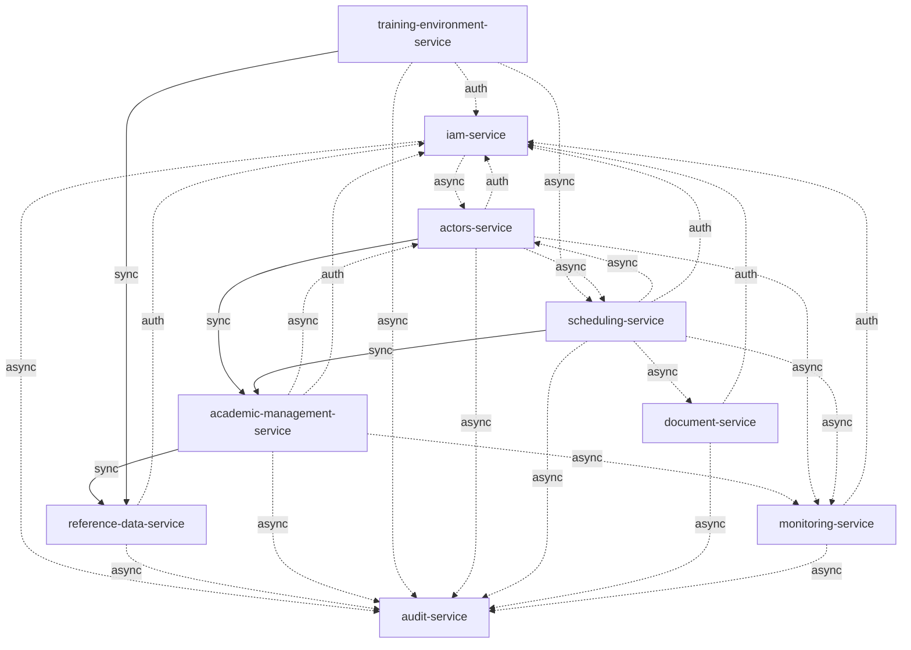

# Mapa de dependencias

> Estado: 🟡 En progreso | Última actualización: 2026-08-01
> Autor: Jesús Ariel González Bonilla (PM + Arquitecto) | Equipo: Arquitectura

Muestra las dependencias entre los 9 microservicios. Las dependencias **síncronas** representan
acoplamiento fuerte (de disponibilidad); las **asíncronas** (eventos) son débilmente acopladas.

> **Nota de alcance — diseño previsto, no implementado.** Las capas de aplicación aún no están
> construidas y no se ha elegido lenguaje. Las dependencias descritas son el **contrato de
> integración previsto**, agnóstico de tecnología. Lo fijo es el transporte: REST sobre HTTP para
> lo síncrono y broker AMQP (RabbitMQ, [ADR-001](../05-architecture/decisions/records/ADR-001-message-broker.md))
> para lo asíncrono.

## Leyenda

- `→ sync` Llamada REST síncrona (acoplamiento fuerte)
- `⟶ async` Consumo de eventos (acoplamiento débil, vía broker AMQP)
- `→ auth` Solo valida JWT contra `iam-service` (sin lógica de negocio; **no** cuenta para el límite de 2)

## Roles en el grafo

- **Servicios base** (sin dependencias de negocio salientes): `iam-service` y
  `reference-data-service`. Son la raíz sobre la que se apoyan los demás.
- **Servicio núcleo**: `scheduling-service` depende (en tiempo de construcción de horario) de
  `training-environment-service` y `actors-service` para disponibilidad, y de
  `academic-management-service` para validar la ficha.
- **Servicios transversales**: `document-service` y `audit-service` atraviesan todo el sistema
  (generación documental bajo demanda; auditoría por fan-out de eventos).

## Diagrama



> Las flechas sólidas (`-->`) son dependencias **síncronas** de negocio; las punteadas (`-.->`)
> son **asíncronas** (eventos) o de **autenticación**. La autenticación se dibuja punteada porque
> no es una dependencia de negocio y no cuenta para el límite de 2.

## Dependencias síncronas

```
scheduling-service           → sync → academic-management-service   (validar ficha/competencias al crear borrador)
scheduling-service           → sync → training-environment-service  (verificar disponibilidad — ver ADR-002)
scheduling-service           → sync → actors-service                (verificar disponibilidad de instructor — ver ADR-002)
actors-service               → sync → academic-management-service   (asignar competencias al instructor)
academic-management-service  → sync → reference-data-service        (catálogos: modalidad, jornada)
training-environment-service → sync → reference-data-service        (tipo de ambiente, sede)

-- Todos los servicios --
*.service                    → auth → iam-service                   (validar JWT)
```

> Las dos dependencias síncronas de `scheduling-service` hacia `training-environment-service` y
> `actors-service` son las que la [ADR-002](../05-architecture/decisions/records/ADR-002-scheduling-read-models.md)
> **elimina** sustituyéndolas por read models locales poblados por eventos. Tras aplicar la ADR,
> `scheduling-service` queda con **1** sola dependencia síncrona (hacia `academic-management-service`),
> reverificando el estado fresco solo en la validación previa a `publish`.

## Dependencias asíncronas (eventos)

Derivadas del [event-catalog.md](./event-catalog.md). El transporte es el broker AMQP
([ADR-001](../05-architecture/decisions/records/ADR-001-message-broker.md)).

```
iam-service                  ⟶ async → audit-service, actors-service
reference-data-service       ⟶ async → audit-service
academic-management-service  ⟶ async → audit-service, monitoring-service, actors-service
training-environment-service ⟶ async → audit-service, scheduling-service  (availability.changed, maintenance.started, environment.created)
actors-service               ⟶ async → audit-service, monitoring-service, scheduling-service  (instructor.assigned)
scheduling-service           ⟶ async → audit-service, monitoring-service, actors-service, document-service  (schedule.published)
document-service             ⟶ async → audit-service
monitoring-service           ⟶ async → audit-service
```

> `audit-service` consume **todos** los topics por wildcard (`#`); `monitoring-service` consume
> los eventos de negocio relevantes. Ninguno se llama síncronamente (R08).

## Regla de dependencias (ADR-002)

> Un servicio no puede depender síncronamente de más de **2 servicios** (excluyendo `iam-service`
> por autenticación). Si se supera, revisar si el bounded context está bien definido o introducir
> un **read model** local poblado por eventos.

| Servicio | Dependencias síncronas (excl. IAM) | ¿Cumple? |
|----------|-----------------------------------|---------|
| `iam-service` | 0 | ✅ |
| `reference-data-service` | 0 | ✅ |
| `academic-management-service` | 1 (reference-data) | ✅ |
| `training-environment-service` | 1 (reference-data) | ✅ |
| `actors-service` | 1 (academic-management) | ✅ |
| `scheduling-service` | 3 hoy → **1** con ADR-002 | ⚠️ Ver [ADR-002](../05-architecture/decisions/records/ADR-002-scheduling-read-models.md) |
| `document-service` | 0 | ✅ |
| `monitoring-service` | 0 (solo async) | ✅ |
| `audit-service` | 0 (solo async) | ✅ |

> `scheduling-service` es el **único** que supera el límite en el diseño base. La
> [ADR-002](../05-architecture/decisions/records/ADR-002-scheduling-read-models.md) resuelve la
> violación con read models locales de instructores/competencias y ambientes/disponibilidad,
> dejándolo en 1 dependencia síncrona conforme a la regla.

## Referencias

- [ADR-001 — Broker de mensajes](../05-architecture/decisions/records/ADR-001-message-broker.md)
- [ADR-002 — Read models para reducir dependencias síncronas](../05-architecture/decisions/records/ADR-002-scheduling-read-models.md)
- [communication-patterns.md](./communication-patterns.md)
- [service-boundary-rules.md](./service-boundary-rules.md)
- [event-catalog.md](./event-catalog.md)
- [service-catalog.md](./service-catalog.md)
