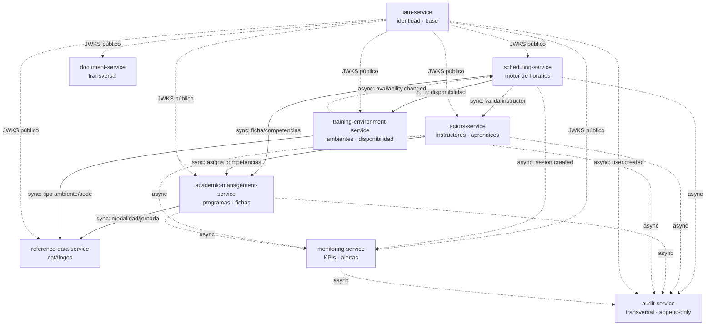

# Dependencias del Proyecto

> Estado: 🟡 En progreso | Última actualización: 2026-08-01
> Autor: Jesús Ariel González Bonilla (PM + Arquitecto) | Equipo: Arquitectura

Dependencias internas (entre servicios) y externas (infraestructura y terceros) del proyecto **Horarios SENA**. Es la vista de gestión de proyecto; el detalle técnico de acoplamiento vive en [dependency-map.md](../09-microservices/dependency-map.md).

## Principios

- `iam-service` es la **base**: todos los servicios dependen de él sólo para validar el JWT (acoplamiento de autenticación, no de negocio).
- `reference-data-service` provee los **catálogos** (modalidad, jornada, tipo de ambiente, sede) que consumen los servicios de dominio.
- `scheduling-service` es el **consumidor pesado**: depende de `training-environment`, `actors` y `academic-management`.
- `document-service` y `audit-service` son **transversales**: los usa toda la plataforma y no dependen de negocio aguas arriba.
- Regla de frontera: máximo **2 dependencias síncronas** por servicio (excluyendo IAM). `scheduling-service` la excede y se resuelve con read models de [ADR-002](../05-architecture/decisions/records/ADR-002-scheduling-read-models.md).

## Diagrama de dependencias

Sólido = llamada síncrona (acoplamiento fuerte). Punteado = evento asíncrono (acoplamiento débil). La autenticación contra IAM se omite del grafo por claridad (todos dependen de IAM para validar JWT).

## Dependencias internas (síncronas)

| Servicio | Depende de (sync, excl. IAM) | Motivo | ¿Cumple regla ≤2? |
|----------|------------------------------|--------|-------------------|
| `iam-service` | — | Servicio base. | ✅ 0 |
| `reference-data-service` | — | Provee catálogos, no consume negocio. | ✅ 0 |
| `academic-management-service` | reference-data | Catálogos de modalidad/jornada. | ✅ 1 |
| `training-environment-service` | reference-data | Tipo de ambiente / sede. | ✅ 1 |
| `actors-service` | academic-management | Asignar competencias al instructor. | ✅ 1 |
| `scheduling-service` | actors, training-environment, academic-management | Validar instructor, disponibilidad y ficha al crear horario. | ⚠️ 3 → ADR-002 |
| `document-service` | — | Transversal; recibe datos por solicitud/evento. | ✅ 0 |
| `monitoring-service` | — | Sólo consume eventos. | ✅ 0 |
| `audit-service` | — | Sólo consume eventos (append-only). | ✅ 0 |

## Dependencias internas (asíncronas / eventos)

Toda mutación relevante se publica como evento y la consumen los servicios transversales. Requiere el broker de [ADR-001](../05-architecture/decisions/records/ADR-001-message-broker.md).

- **`audit-service`** consume eventos de todos los servicios (log append-only de todas las mutaciones).
- **`monitoring-service`** consume eventos de dominio (`sesion.created`, `conflict.detected`, `instructor.assigned`, `ficha.opened/closed`, etc.) para KPIs y alertas.
- **`scheduling-service`** consume `availability.changed` de `training-environment-service` para invalidar/actualizar sus read models.

## Dependencias externas

| Dependencia | Tipo | Uso | Estado | Riesgo asociado |
|-------------|------|-----|--------|-----------------|
| **PostgreSQL 16** | Base de datos | Motor relacional de cada servicio; esquema versionado con Liquibase. | ✅ En uso (capa de datos) | — |
| **Liquibase** | Herramienta de migración | Versionado y despliegue del esquema por repo `*-db`. | ✅ En uso | R-002, R-009 (ver [risks.md](./risks.md)) |
| **Driver JDBC PostgreSQL** | Librería | Conector usado por Liquibase. | ⚠️ Versión obsoleta | R-009 |
| **Docker** | Runtime/orquestación local | Levantar PostgreSQL y (a futuro) los servicios. | ✅ En uso local | — |
| **Broker de mensajes** ([ADR-001](../05-architecture/decisions/records/ADR-001-message-broker.md)) | Middleware async | Transporte de eventos hacia `audit` y `monitoring`. | 🔴 No provisionado (ADR `PROPOSED`) | R-005 |
| **Object storage** ([ADR-003](../05-architecture/decisions/records/ADR-003-object-storage.md)) | Almacenamiento binario | Guardar PDFs/exports de `document-service` (sólo `storage_key` en BD). | 🔴 No provisionado | — |
| **Secret Manager** | Gestión de secretos | Alojar credenciales hoy en `.env.*` versionados. | 🔴 Pendiente | R-001 |

## Orden de construcción recomendado

Derivado de las dependencias: `iam` → (`reference-data`) → `academic-management` / `training-environment` → `actors` → `scheduling` → transversales (`document`, `audit`, `monitoring`). Ver fases A–E en [technical-backlog.md](./technical-backlog.md).
